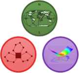
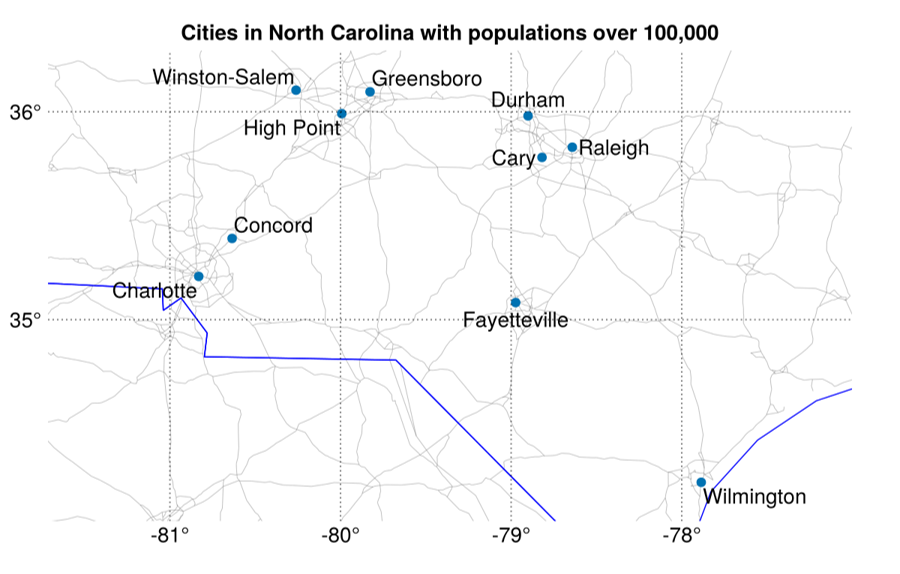

# Logjam



[](https://mgkay.github.io/Logjam.jl/stable/)
[](https://mgkay.github.io/Logjam.jl/dev/)
[](https://github.com/mgkay/Logjam.jl/actions/workflows/CI.yml?query=branch%3Amaster)
[](https://codecov.io/gh/mgkay/Logjam.jl)

Logjam is a Julia package that provides tools and data for common logistics engineering tasks, including map visualizations and working with U.S. geographical and statistical data.

## Installation

To install Logjam, use the following command in your Julia REPL:

```julia
using Pkg
Pkg.add("Logjam")
```

## Example Usage

Here’s an example that demonstrates how to use Logjam to visualize cities in North Carolina with populations over 100,000 using GeoMakie and DataFrames:

```julia
using GeoMakie, DataFrames

# Filter U.S. place data for cities in North Carolina with populations over 100,000
df = filter(r -> (r.STFIP == st2fips(:NC)) && (r.POP > 100_000), usplace())

# Extract longitude, latitude, and city names from dataframe
x, y, name = df.LON, df.LAT, df.NAME

# Create and title a map figure and axis
fig, ax = makemap(x, y)
ax.title = "Cities in North Carolina with populations over 100,000"

# Plot cities as scatter points
scatter!(ax, x, y)

# Annotate the scatter plot with city names
text!(ax, x, y, text=name; aligntext(x, y)...)

# Display the map
display(fig)
```
In the above code, `st2fips`, `usplace`, `makemap`, and `aligntext` are Logjam functions.


