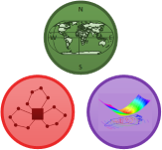
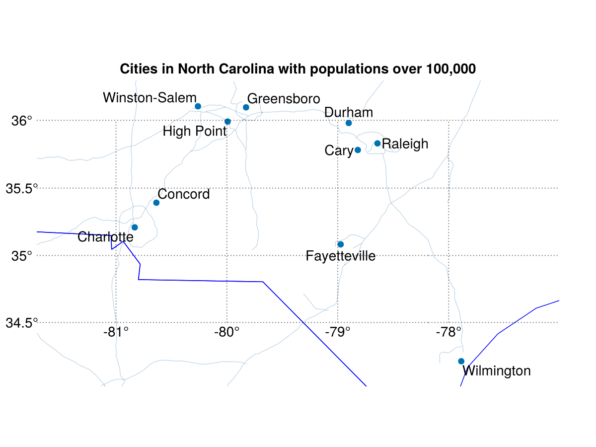
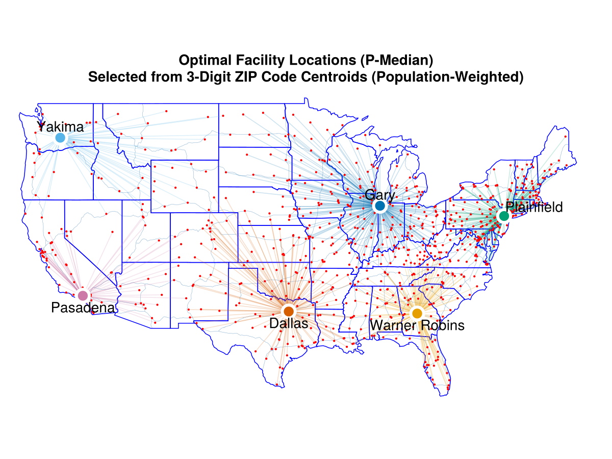
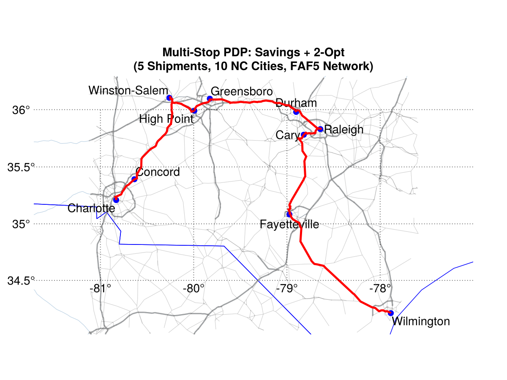
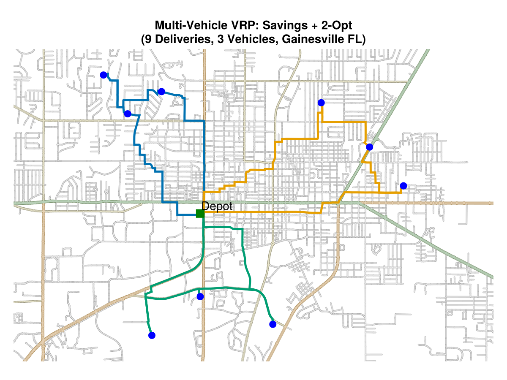

# Logjam



[](https://mgkay.github.io/Logjam/)

Logjam is a Julia package for logistics engineering, providing tools for:
* **Facility Location**: Discrete optimization algorithms for facility location problems, including Uncapacitated Facility Location (UFL) and *p*-Median construction and improvement heuristics.
* **Transportation Costing**: Formulas for estimating LTL & TL freight rates, calculating minimum charges, and evaluating total logistics costs (TLC).
* **Network Analysis**: Routing and topology tools for the FAF5 highway network, including shortest paths and automatic facility connectors.
* **Vehicle Routing**: Algorithms for multi-stop route optimization, featuring savings-based construction and local search improvement methods.
* **Spatial Data**: A gazetteer of U.S. administrative boundaries and points, including Cities, Counties, ZIP codes (3- and 5-digit), Census tracts, and CBSA/CSA definitions.
* **Distance Metrics**: Unified distance calculation utilities supporting Rectilinear (*L*₁), Euclidean (*L*₂), and Great Circle (Haversine) metrics.
* **Plotting**: Display helper (`dcf`) via CairoMakie extension.
* **Mapping**: Plotting recipes and helper functions for mapping spatial data using GeoMakie.
* **Data Helpers**: Matrix-to-DataFrame conversion (`mat2df`), formatted printing (`prt`), and floating-point snapping (`snapvals`).

## Installation

To install Logjam, use the following command in your Julia REPL:

```julia
using Pkg
Pkg.add(url="https://github.com/mgkay/Logjam.git")
```

## Dependencies

Logjam uses Julia package extensions to keep its core lightweight. Features activate automatically based on which packages are loaded:

| `using` statement | Features enabled |
|---|---|
| `using Logjam` | Core: facility location, costing, distances, road networks, routing, spatial data, data helpers. |
| `using Logjam, CairoMakie` | + plotting: `dcf`. |
| `using Logjam, CairoMakie, GeoMakie` | + mapping: `makemap`, `plotroads!`, `plotroute!`, `aligntext`. |
| `using GLMakie; using Logjam` | + interactive map display via `backend=:GLMakie`. |
| `using LightOSM, NearestNeighbors; using Logjam` | + OSM roads: `osm_roads`, `stitchnetworks`. |

## Worked Examples

The examples below are ordered for incremental capability building — each one introduces a focused set of Logjam functions that later examples build upon. The full capability set is described in the overview bullets above. All examples are available as a runnable Jupyter notebook: [logjam_examples.ipynb](https://github.com/mgkay/Logjam/blob/main/examples/logjam_examples.ipynb).

---

### Example 1 — Spatial Data

Logjam includes a built-in U.S. gazetteer covering cities (`usplace`), counties (`uscounty`), 3- and 5-digit ZIP codes (`uszcta3`, `uszcta5`), CBSAs (`uscbsa`), and CSAs (`uscsa`). All tables share a consistent schema: FIPS codes for joining, LON/LAT coordinates following the Logjam convention (longitude first), and population counts where available. This example demonstrates loading and filtering place data, FIPS code conversion, and geographic name lookup.

```julia
using Logjam
using DataFrames

# Load U.S. place data (cities, towns, CDPs) and inspect the schema
places = usplace()
display(first(places[:, [:NAME, :ST, :LON, :LAT, :POP, :ISCUS]], 4))
```

```
4×6 DataFrame
 Row │ NAME            ST      LON       LAT      POP    ISCUS
     │ String          Symbol  Float64   Float64  Int64  Bool
─────┼─────────────────────────────────────────────────────────
   1 │ Albertville     AL      -86.2107  34.2631  22386   true
   2 │ Alexander City  AL      -85.9371  32.9272  14843   true
   3 │ Anniston        AL      -85.8109  33.6735  21564   true
   4 │ Auburn          AL      -85.4895  32.6077  76143   true
```

```julia
# FIPS conversion: state symbol ↔ FIPS code
fips_nc = st2fips(:NC)           # 37
fips2st(fips_nc)                 # :NC

# Filter to NC cities with population over 100,000
nc_large = filter(r -> r.STFIP == fips_nc && r.POP > 100_000, places)
println("$(nrow(nc_large)) NC cities with pop > 100k")

# Forward geocoding: city name to coordinates
raleigh_xy = name2lonlat("Raleigh, NC", places)   # [-78.64, 35.78]

# Reverse geocoding: coordinates to nearest named place
nearest = lonlat2name([-78.85 35.73], filter(r -> r.POP > 50_000 && r.ISCUS, places))
println("Nearest large city: $(nearest.name[1]) ($(round(nearest.dist[1]; digits=1)) mi)")

# Load continental US 3-digit ZIP centroids
z3 = filter(r -> r.ISCUS, uszcta3())
println("Continental US 3-digit ZIPs: $(nrow(z3))")
```

```
10 NC cities with pop > 100k
Nearest large city: Apex (1.3 mi)
Continental US 3-digit ZIPs: 882
```

**After-action.** The `ISCUS` flag is the standard filter for continental U.S. analysis — it removes Alaska, Hawaii, Puerto Rico, and other territories that would distort national maps. All coordinate columns follow the (LON, LAT) convention throughout Logjam, which means western longitudes are negative. The `st2fips` and `fips2st` functions enable joins between datasets that use different geographic identifiers. `lonlat2name` is used in later examples to reverse-geocode facility hub coordinates into interpretable city names, making model outputs readable without manual lookup. The `name2lonlat` function provides the inverse operation when building scenarios from named locations.

---

### Example 2 — Mapping

Logjam's `makemap` function creates GeoMakie map figures with automatic projection, region detection, and a FAF5 interstate highway background. This example maps NC cities and introduces the full mapping toolkit: `makemap` for the figure and axis, `scatter!` and `text!` for data, `aligntext` for automatic label positioning, and the `hborders` return value for customizing the built-in road overlay.

```julia
using Logjam
using CairoMakie, GeoMakie, DataFrames

# Load NC cities with population > 100,000
cities = filter(r -> r.STFIP == st2fips(:NC) && r.POP > 100_000, usplace())
x, y, name = cities.LON, cities.LAT, cities.NAME

# Create map — auto-fits region to data; draws FAF5 interstates by default
fig, ax, hborders, _ = makemap(x, y)
ax.title = "North Carolina Cities with Population > 100,000"

hborders[1].color[] = (:steelblue, 0.5)

# Plot city locations and labels
scatter!(ax, x, y, color=:red, markersize=12)
text!(ax, x, y, text=name; aligntext(x, y)...)

dcf()
```



**After-action.** `makemap` detects when coordinates fall within the continental U.S. and automatically overlays the FAF5 interstate network as a geographic reference. The `hborders` return value exposes the road and border line handles for post-hoc styling, as shown above for the interstate color. `aligntext(x, y)` returns a named tuple of keyword arguments (`:align`, `:offset`) that are splatted into `text!` via `...`, automatically positioning each label to avoid overlap with its marker.

---

### Example 3 — Facility Location

A classic strategic logistics problem: place a fixed number of distribution hubs to minimize total weighted distance to customers. Using U.S. 3-digit ZIP code centroids as demand points and population as demand weight, the *p*-median model selects six hubs that minimize total people-miles. This example introduces `dists` for distance matrix construction, `pmedian`, `alloclines`, and `lonlat2name` for the full facility location workflow, and `prt` for formatted matrix display.

```julia
using Logjam
using CairoMakie, GeoMakie, DataFrames

# Load continental US 3-digit ZIP code centroids
z3 = filter(r -> r.ISCUS, uszcta3())
XY = hcat(z3.LON, z3.LAT)

# Build population-weighted cost matrix: C[i,j] = distance(i,j) × population(j)
C = dists(XY, XY, :mi) .* z3.POP'

# Solve p-median: select 6 hubs minimizing total people-miles
y, TC, W = pmedian(6, C; verbose=false)

# Reverse-geocode hub coordinates to nearest large city
hubs = lonlat2name(XY[y, :], filter(r -> r.POP >= 50_000 && r.ISCUS, usplace()))

# Display hub locations (prt auto-formats coordinates)
prt(XY[y, :]; rows=hubs.name, cols=["LON", "LAT"], row_title="Hubs")
```

```
 ─────────────── ───────── ───────
           Hubs       LON     LAT
 ─────────────── ───────── ───────
           Gary    -87.35   41.60
  Warner Robins    -83.62   32.61
     Plainfield    -74.42   40.63
       Pasadena   -118.13   34.15
         Yakima   -120.51   46.60
         Dallas    -96.77   32.78
 ─────────────── ───────── ───────
```

```julia
# Map: continental US with allocation lines and hub markers
fig, ax = makemap(region=:CUS)

colors = Makie.wong_colors()[1:6]
X, Y = alloclines(W, XY, XY)
for (ci, i) in enumerate(y)
    lines!(ax, X[i], Y[i], color=(colors[ci], 0.2), linewidth=0.8)
end

scatter!(ax, XY[:, 1], XY[:, 2], color=:red, markersize=3, strokewidth=0)
hub_xy = XY[y, :]
scatter!(ax, hub_xy[:, 1], hub_xy[:, 2], color=colors, markersize=18,
         strokewidth=3, strokecolor=:white)
text!(ax, hub_xy[:, 1], hub_xy[:, 2], text=hubs.name; aligntext(hub_xy[:, 1], hub_xy[:, 2])...)

ax.title = "Optimal Facility Locations (P-Median)\nSelected from 3-Digit ZIP Code Centroids (Population-Weighted)"
dcf()
```



**After-action.** `dists(XY, XY, :mi)` computes a full pairwise great-circle distance matrix in miles; the `:mi` symbol selects miles, `:km` selects kilometers, and `:gc` returns dimensionless radians. Broadcasting `.* z3.POP'` weights each column by the destination's population, converting the distance matrix into a cost matrix in people-miles. `pmedian` returns the hub indices `y`, total cost `TC`, and the allocation matrix `W` (a sparse indicator mapping each demand point to its nearest hub). `alloclines` converts `W` into NaN-separated line segment vectors per hub, which `lines!` renders efficiently without a loop per connection. `lonlat2name` reverse-geocodes the hub coordinates to the nearest large city, providing interpretable labels. `prt` displays the hub coordinate matrix as a formatted table with city-name row labels, automatic decimal detection, and comma-separated large numbers. For problems where the number of facilities is itself a decision, Logjam provides UFL heuristics — `ufladd`, `ufldrop`, `uflxchg`, and `ufl` — that optimize both facility selection and count.

---

### Example 4 — Pickup and Delivery Routing

Road network routing in Logjam uses the FAF5 national freight highway network as the foundation. The standard pipeline — `cropnetwork` → `addconnectors` → `links2graph` → `shortestpaths` — prepares a network for any routing task.

A pickup and delivery problem (PDP) is a routing problem where each shipment has a distinct origin and destination. This example routes five shipments across ten NC cities using the FAF5 highway network. The vehicle does not return to a starting depot — the route connects pickups and deliveries in the optimal sequence.

```julia
using Logjam
using CairoMakie, GeoMakie, DataFrames

# Load NC cities with population > 100,000
cities = filter(r -> r.STFIP == st2fips(:NC) && r.POP > 100_000, usplace())

# City index (alphabetical order from filter)
prt(DataFrame(Index = 1:nrow(cities), City = cities.NAME))
```

```
 ─────── ───────────────
  Index            City
 ─────── ───────────────
      1            Cary
      2       Charlotte
      3         Concord
      4          Durham
      5    Fayetteville
      6      Greensboro
      7      High Point
      8         Raleigh
      9      Wilmington
     10   Winston-Salem
 ─────── ───────────────
```

```julia
# Define 5 shipments with distinct origins and destinations
sh = DataFrame(                  # shipments
    b = [2, 3, 10, 7, 6],   # Pickup city index
    e = [8, 4,  1, 5, 9]    # Delivery city index
)

# Shipment manifest with city names
prt(DataFrame(
    Shipment = 1:nrow(sh),
    Origin = cities.NAME[sh.b],
    Destination = cities.NAME[sh.e]))
```

```
 ────────── ─────────────── ──────────────
  Shipment          Origin    Destination
 ────────── ─────────────── ──────────────
         1       Charlotte        Raleigh
         2         Concord         Durham
         3   Winston-Salem           Cary
         4      High Point   Fayetteville
         5      Greensboro     Wilmington
 ────────── ─────────────── ──────────────
```

```julia
# Build road network: crop FAF5 to region, attach city connectors
x, y = cities.LON, cities.LAT
dfN, dfL = addconnectors(cropnetwork(faf5nodes(), faf5links(), x, y)..., x, y)  # nodes, links
D, P = shortestpaths(links2graph(dfL), nrow(cities))  # distance, parents

# Display highway distance matrix (miles) with abbreviated city names
cnames = [length(n) > 7 ? first(n, 4) * "." : n for n in cities.NAME]
prt(round.(Int, D); rows=cnames, cols=cnames, row_title="City")
```

```
 ───────── ────── ─────── ───────── ──────── ─────── ─────── ─────── ───────── ─────── ───────
     City   Cary   Char.   Concord   Durham   Faye.   Gree.   High.   Raleigh   Wilm.   Wins.
 ───────── ────── ─────── ───────── ──────── ─────── ─────── ─────── ───────── ─────── ───────
     Cary      0     165       138       25      60      79      91         8     130     104
    Char.    165       0        25      140     130      92      80       157     196      80
  Concord    138      25         0      129     119      80      68       131     185      67
   Durham     25     140       129        0      85      54      66        25     155      79
    Faye.     60     130       119       85       0     119     131        68      92     144
    Gree.     79      92        80       54     119       0      15        80     189      27
    High.     91      80        68       66     131      15       0        92     201      31
  Raleigh      8     157       131       25      68      80      92         0     137     104
    Wilm.    130     196       185      155      92     189     201       137       0     221
    Wins.    104      80        67       79     144      27      31       104     221       0
 ───────── ────── ─────── ───────── ──────── ─────── ─────── ─────── ───────── ─────── ───────
```

```julia
# Construct route with savings heuristic, then improve with 2-opt
rteTCh(r) = rteTC(r, sh, D)  # route total cost handle
rte = savings(rteTCh, sh)    # route
rte, cost = twoopt(rte[1], rteTCh)

# Map: NC region with road network overlay and optimized route
fig, ax = makemap(x, y)
plotroads!(ax, dfN, dfL)

plotroute!(ax, rte, sh, P, dfN; color=:red, linewidth=2.5, show_markers=false)

scatter!(ax, x, y, color=:blue, markersize=10)
text!(ax, x, y, text=cities.NAME; aligntext(x, y)...)

ax.title = "Multi-Stop PDP: Savings + 2-Opt\n(5 Shipments, 10 NC Cities, FAF5 Network)"
dcf()
```



**After-action.** `cropnetwork` extracts the FAF5 subgraph covering the demand points, reducing graph size before solving. `addconnectors` appends connector edges from each demand point to its nearest network node. `shortestpaths` computes shortest-path distances `D` and parent pointers `P` from the connector nodes. `prt` displays the distance matrix with city-name rows/columns and the `row_title` keyword in the upper-left corner; it also generates the city index and shipment manifest from inline DataFrames. `plotroads!` renders the road network with FCLASS-based styling — roads are colored and sized by functional class (interstates in muted blue, arterials in warm yellow, local roads in white/gray). `savings` constructs an initial route by iteratively merging the most cost-saving shipment pair, then `twoopt` improves it by reversing sub-sequences. `plotroute!` reconstructs the road-following path for each leg from the parent pointers and renders the result.

---

### Example 5 — Vehicle Routing (OSM Network)

> **Requires OSM extension:** load `LightOSM` and `NearestNeighbors` before `Logjam`.

The `osm_roads` function downloads a local OpenStreetMap road network and integrates it with the same connector pipeline used for FAF5 routing. This example solves a capacitated multi-vehicle VRP in Gainesville, FL — three vehicles with a maximum of three deliveries each share nine stops from a central depot, with each vehicle returning after completing its route.

```julia
using LightOSM, NearestNeighbors  # Must precede Logjam to activate OSM extension
using Logjam
using CairoMakie, GeoMakie, DataFrames

# Stop coordinates: stop 1 = depot (UF campus), stops 2–10 = deliveries
x = [-82.340, -82.360, -82.355, -82.348, -82.305, -82.298, -82.315, -82.340, -82.325, -82.350]
y = [ 29.650,  29.675,  29.668,  29.672,  29.662,  29.655,  29.670,  29.635,  29.630,  29.628]

# Download OSM road network covering the stop region
bbox_limits, _ = mapbbox(x, y; xexpand=0.1, yexpand=0.1)
bbox = (bbox_limits[1]..., bbox_limits[2]...)
dfN0, dfL0 = osm_roads(bbox; cache_dir=joinpath(@__DIR__, "data"))  # nodes, links

# Build network and shortest paths
dfN, dfL = addconnectors(dfN0, dfL0, x, y; add_nf_nf=false)
D, P = shortestpaths(links2graph(dfL), length(x))  # distance, parents

# VRP: all deliveries depart from depot (stop 1), max 3 per vehicle
sh = DataFrame(b = fill(1, 9), e = 2:10)  # shipments
tr = (b=[1], e=[1])                        # truck
rteTCh(r) = length(r) > 6 ? Inf : rteTC(r, sh, D, tr)  # route total cost handle

rte = savings(rteTCh, sh)  # route
rte = [twoopt(r, rteTCh)[1] for r in rte]

# Map: OSM road network with color-coded vehicle routes
fig, ax = makemap(x, y)
plotroads!(ax, dfN, dfL)

plotroute!(ax, rte, sh, P, dfN; tr=tr, linewidth=2.5, show_markers=false)

scatter!(ax, x[2:end], y[2:end], color=:blue, markersize=12)
scatter!(ax, [x[1]], [y[1]], color=:green, markersize=16, marker=:rect)
text!(ax, [x[1]], [y[1]], text=["Depot"]; aligntext([x[1]], [y[1]])...)

ax.title = "Multi-Vehicle VRP: Savings + 2-Opt\n(9 Deliveries, 3 Vehicles, Gainesville FL)"
dcf()
```



**After-action.** `mapbbox` derives a bounding box with 10% expansion to ensure the downloaded OSM region covers all stops. `osm_roads` downloads drivable roads from the Overpass API and caches results as CSV; subsequent calls with the same bbox load from cache. `add_nf_nf=false` disables direct demand-to-demand connectors that would bypass the road network. The capacity constraint is enforced through the cost function: `length(r) > 6 ? Inf` limits each route to three deliveries (each shipment appears as a pickup–delivery pair), causing `savings` to produce multiple routes. `tr=(b=[1], e=[1])` specifies that each route begins and ends at the depot. The multi-route `plotroute!` method automatically assigns a distinct color per vehicle from the Wong palette. For scenarios requiring local OSM detail integrated with the national FAF5 network, `stitchnetworks` creates connector edges between the two networks, returning a unified graph compatible with the standard routing pipeline.
